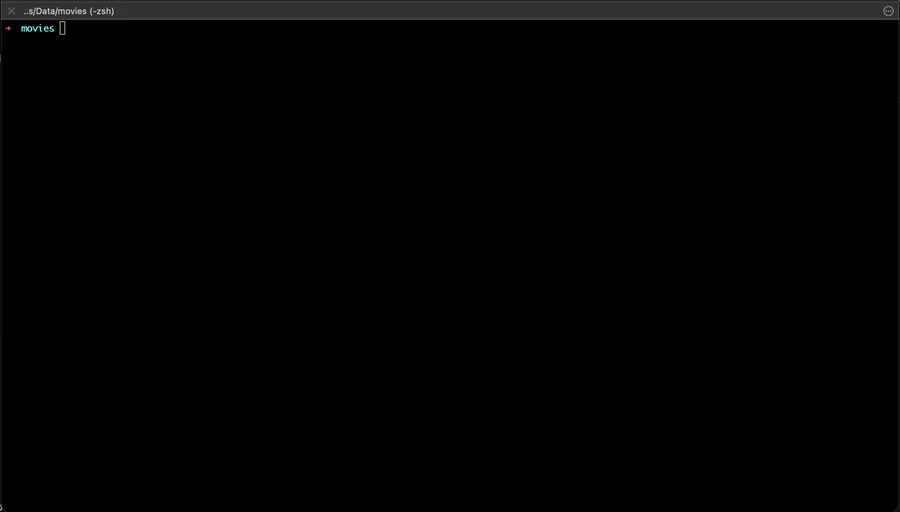

# OpenSubs CLI

A full featured, easy to use, CLI app to download subtitles from OpenSubtitles.com.



## Credits

This project is based on [subs-cli](https://github.com/alexandrucancescu/subs-cli) by [Alexandru Cancescu](https://github.com/alexandrucancescu). The original project has been updated to work with the new OpenSubtitles.com API and republished under a new package name to continue its development.

## Features

- Download subtitles for a single file or an entire directory (recursively)
- Download the best subtitle per language, saved as `movie.fr.srt`, `movie.en.srt`
- Download all available subtitle results into a subfolder `movie/subname.fr.srt`
- Multi-language support — download subtitles for several languages in one run
- **Sidecar files** — pin an exact IMDB ID to a file or folder for reliable ID-based lookups (`-W`)
- First **5 downloads are free** without an account; login to get up to 1000/day
- Credentials stored securely in your OS keychain (Keychain / Credential Vault / Secret Service)
- Interactive language picker fetched live from the OpenSubtitles API
- Skips files that already have subtitles (use `--overwrite` to re-download)
- No API key setup required — just install and use

## Install

```sh
npm install -g opensubs-cli
```

If you encounter an `EACCES` error on macOS, see [Installation Problems](#installation-problems).

## Requirements

You can start immediately — the first **5 subtitle downloads are free** without an account.

After 5 downloads, create a free account at [opensubtitles.com](https://www.opensubtitles.com/en/users/sign_up). You only need your username and password; the API key is embedded in the tool.


You will get 20 downloads per day with a free account, more downloads can be obtain by contributing to the commmunity and upload subtitles, or purchase a VIP subscription [more infos](https://www.opensubtitles.com/en/support_us/)

---

## Usage

### Basic

```sh
# Download subtitles for a single file
opensubs /path/to/movie.mkv

# Download subtitles for all video files in a directory (recursive)
opensubs /path/to/dir
```

The subtitle is saved alongside the video file: `movie.fr.srt` (language code always included).

---

### Options reference

```
Usage: opensubs <path> [options]

Info:
  -V, --version              output the version number
  -c, --config               show current configuration and exit
  -I, --info                 show your OpenSubtitles account info from the API
  --set-languages            interactively set default language(s) from the API list
  -h, --help                 display help for command

Sidecar:
  -W, --lookup-feature       search for a title and write a .opensubs sidecar file
  --type <movie|episode>     force type for -W (default: auto-detect)
  --query <value>            custom search query for -W (overrides filename/guessit)

Download:
  -l, --lang <value>         language code(s), e.g. en or en,fr,de  (default: en)
  -L, --all-languages        best subtitle per language  → movie.fr.srt, movie.en.srt
  -F, --all-files            all results into a subfolder  → movie/subname.fr.srt
  -o, --overwrite            overwrite existing subtitles
  -s, --save-lang            save language as default

Options:
  -N, --no-prompt            never prompt for user input

Debug:
  -d, --debug                enable all debug output (requests, responses, headers)
  --debug-request            show debug output for API requests
  --debug-response           show debug output for API responses
  --debug-headers            show debug output for HTTP headers
```

---

### Language

Languages are identified by their [ISO 639-1](https://en.wikipedia.org/wiki/List_of_ISO_639-1_codes) code (e.g. `en`, `fr`, `de`). Some languages use extended codes such as `pt-pt`, `pt-br`, `zh-cn`, `zh-tw`.

```sh
# Download French subtitles
opensubs /path/to/movie.mkv -l fr

# Download and save French as the default language
opensubs /path/to/movie.mkv -l fr -s
```

Use `--set-languages` to pick from the full list fetched live from the API:

```sh
opensubs --set-languages
```

This displays all supported language codes and lets you type one or more codes (e.g. `en,fr,de`) to save as your default.

---

### Multi-language (`-L`)

Download the best matching subtitle for each language in your list, saved as `movie.<lang>.srt` alongside the video file.

```sh
# Download best English and French subtitles
opensubs /path/to/dir -L -l en,fr
```

Output:
```
movie.en.srt
movie.fr.srt
```

---

### All results (`-F`)

Download **every** subtitle result (not just the best match) for a video into a subfolder named after the video file. The language code is appended to each subtitle filename.

```sh
# All French results for a file
opensubs /path/to/movie.mkv -F -l fr
```

Output:
```
movie/
  Movie.2024.DVDRIP.fr.srt
  Movie.2024.WEB-DL.fr.srt
  ...
```

Combine `-F` and `-L` to get all results for every language in the same folder:

```sh
opensubs /path/to/dir -F -L -l en,fr
```

Output:
```
movie/
  Movie.2024.DVDRIP.en.srt
  Movie.2024.DVDRIP.fr.srt
  Movie.2024.WEB-DL.en.srt
  ...
```

---

### Configuration (`-c`)

Show the current configuration — config file path, saved account, language, anonymous quota, and token status:

```sh
opensubs -c
```

---

### Account info (`-I`)

Query the OpenSubtitles API for your account details (level, daily download quota, remaining downloads, VIP status):

```sh
opensubs -I
```

Example output:
```
  OpenSubs — Account Info
────────────────────────────────────────────
  Username           : yourname
  Level              : Sub leecher
  User ID            : 12345
  Allowed downloads  : 20
  Remaining today    : 18
  Downloads used     : 2
  VIP                : No
  Authenticated      : Yes
────────────────────────────────────────────
```

---

### Overwrite (`-o`)

By default, files that already have a subtitle alongside them are skipped. Use `--overwrite` to force re-download:

```sh
opensubs /path/to/dir -o
```

---

### No prompt (`-N`)

Skip all interactive confirmation prompts (useful for scripting / automation):

```sh
opensubs /path/to/dir -N
```

---

## Sidecar files

A **sidecar** is a small text file placed next to a video file (or inside a TV show folder) that pins an exact IMDB ID to it. Once a sidecar exists, `opensubs` always searches by that ID instead of guessing from the filename — giving more reliable results, especially for files with ambiguous names.

### Why use sidecars?

Subtitle search falls back to the filename when a file is not in the OpenSubtitles hash database (most encodes). A filename like `Movie.2012.BluRay.mkv` usually works, but edge cases exist:

- Files named only with technical info (`BigBuckBunny_320x180.mp4`)
- Renamed files or personal rips
- Episodes of lesser-known shows

A sidecar eliminates the guesswork permanently.

### Creating a sidecar with `-W`

Run `-W` on any video file or TV show folder to search OpenSubtitles and write a sidecar:

```sh
# Movie file — creates Movie.2012.BluRay.opensubs
opensubs -W /path/to/Movie.2012.BluRay.mkv

# TV show folder — creates /path/to/ShowName/.folder.opensubs
opensubs -W /path/to/ShowName/

# Override the search query (useful for ambiguous filenames)
opensubs -W /path/to/BigBuckBunny_320x180.mp4 --query "Big Buck Bunny" --type movie
```

`-W` shows a numbered list of results from OpenSubtitles. Select the correct one and the sidecar is written immediately.

After that, every subtitle download for that file or folder uses the pinned ID:

```sh
opensubs /path/to/Movie.2012.BluRay.mkv -l fr
```

### TV shows — folder sidecar

Point `-W` at the **show folder** (not an individual episode file) to write a single `.folder.opensubs` with the show's IMDB ID. All episodes inside that folder will pick it up automatically, with season and episode numbers extracted from each filename:

```sh
# Write once for the whole series
opensubs -W /path/to/Pioneer.One/ --query "Pioneer One"

# Now download subtitles for any episode — sidecar is found automatically
opensubs /path/to/Pioneer.One/S01E01.mp4 -l en
```

### Sidecar file format

Sidecars are plain `key=value` text files, one entry per line. You can create or edit them by hand:

**Movie file sidecar** (`.Movie.opensubs` next to `Movie.mkv`):
```
imdb_id=1254207
type=movie
```

**TV show folder sidecar** (`.folder.opensubs` inside the show folder):
```
parent_imdb_id=1748166
type=episode
```

### Lookup priority

When downloading subtitles, `opensubs` checks for sidecar metadata in this order:

1. **File sidecar** — `.MyMovie.opensubs` next to the video file
2. **Folder sidecar** — `.folder.opensubs` inside the parent directory
3. **Hash + filename** — computed hash and guessit-parsed title (default fallback)

A file-level sidecar always wins over a folder sidecar, so you can override individual episodes without changing the folder-level setting.

---

## Installation problems

### macOS

npm installs global packages into `/usr/local/lib/node_modules`. You may need to run with `sudo`:

```sh
sudo npm install -g opensubs-cli
```

That can cause a secondary problem: npm drops sudo privileges for scripts and sets the user to `nobody`, preventing **keytar** (the secure credential store) from installing its native modules.

The cleanest workaround is to change ownership of the global node_modules directory and install without sudo:

```sh
sudo chown -R $(whoami):admin /usr/local/lib/node_modules
npm install -g opensubs-cli
```

Alternatively:

```sh
sudo npm install -g --unsafe-perm opensubs-cli
```

More info [here](https://stackoverflow.com/questions/47252451/permission-denied-when-installing-npm-modules-in-osx).

---

## License

The code in this project is licensed under the MIT License. See [LICENSE](LICENSE) for details.
